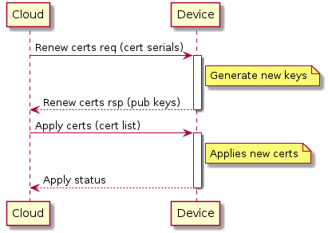
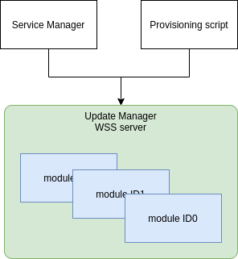

# Renew certificates design document

## Protocol (TBD)

4 messages:

* renew request, from cloud to device with the list of certs serial which should be renewed;
* renew response, from device to clod with the list of public keys;
* apply certs, from cloud to device with the list of new certs;
* apply response, from device to cloud with applying status.



## High Level Design

* Renew certificates will be done as part of Update Manager (UM)
* UM protocol will be extended to support renew certificates
* To support different update certificates approaches, certificate update mechanism should be implemented as modules (plugins)
* Each plugin will have its unique module ID
* Currently we are going to update ServiceManager certificates. Update Service Manager certs module will be implemented in UM
* Two Service Manager certs update modules should be implemented: one using TPM (for Nuance), another using file system to store/retrieve keys/certs (generic AOS)
* Provisioning script should not update certs itself but should communicated with UM in order to apply initial certificates (TBD)



## UM protocol extension

Following new commands will be add in order to support renew certificates:

* Create key request:

```json
{
    "header": {
        "version": 2,
        "messageType": "createKeyRequest"
    },
    "data": {
        "id": "module ID"
    }
}
```

* Create key response:

```json
{
    "header": {
        "version": 2,
        "messageType": "createKeyResponse"
    },
    "data": {
        "id": "module ID",
        "pubKey": "publicKey"
    }
}

```

* Apply certificate request:

```json
{
    "header": {
        "version": 2,
        "messageType": "applyCertificateRequest"
    },
    "data": {
        "id": "module ID",
        "certificate": "certificate"
    }
}
```

* Apply certificate response:

```json
{
    "header": {
        "version": 2,
        "messageType": "applyCertificateResponse"
    },
    "data": {
        "id": "module ID",
        "status": "success"
    }
}
```

## UM Update certs module interface