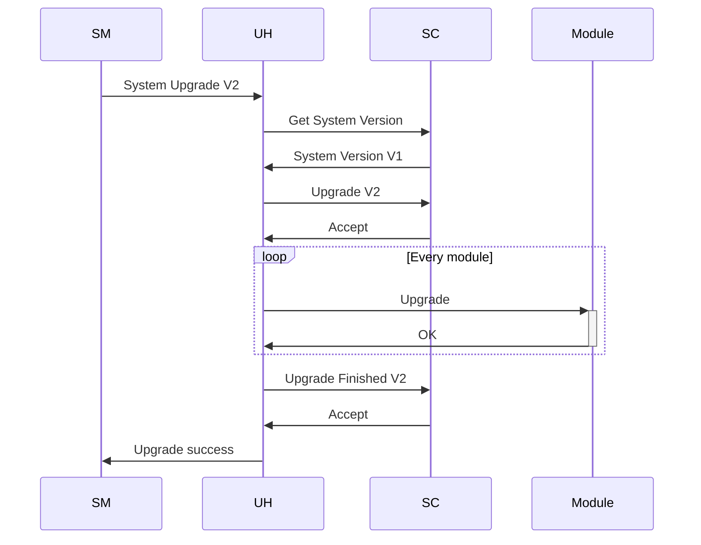
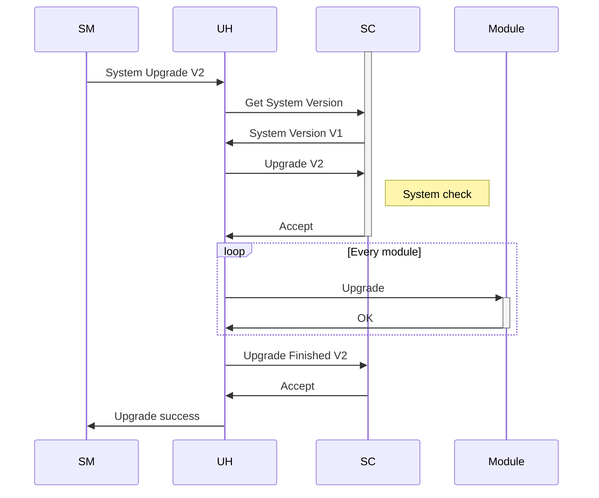
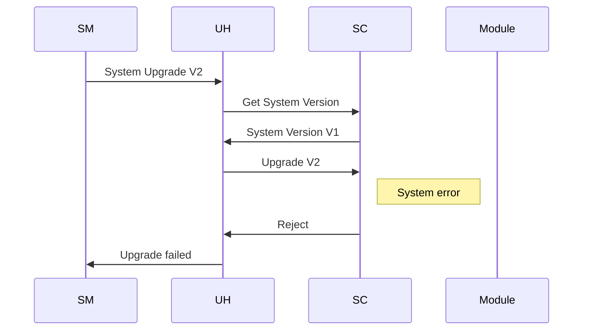
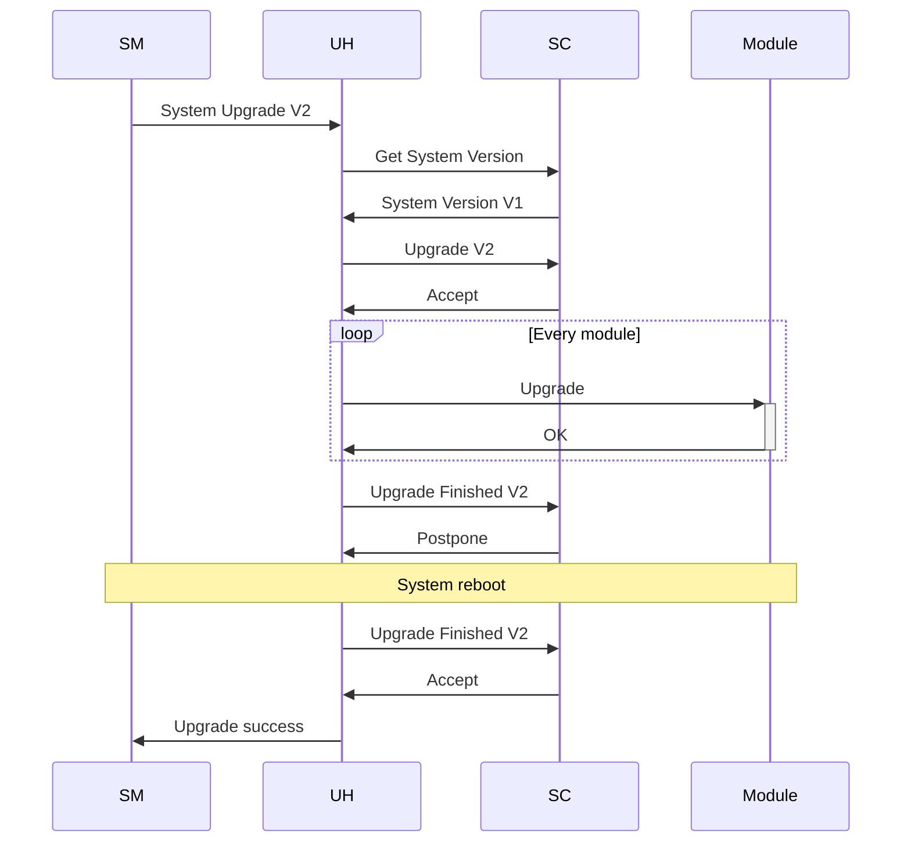

# State Controller

State Controller (SC) is used to extend and customize system upgrade functionality. The update handler (UH) notifies SC when new upgrade or revert request is received. SC may accept, reject or delay the system upgrade. UH notifies SC when all system modules are updated or reverted. SC may accept, reject, delay the upgrade or revert at this stage as well. SC may decide to do not finish the upgrade or revert procedure but rather to postpone it till next UM start. SC should provide the installed image version.

SC is optional and can be disabled. If SC is enabled, UH should:
* get current installed image version from SC;
* notify SC about upgrade start by calling appropriate API;
* notify SC when all modules are successfully upgraded by calling appropriate API.

SC can delay the system upgrade for example if it performs some system check etc. And upgrade is not possible at the moment.

SC can reject the system upgrade due to some serious system error, for example. In this case failed upgrade status will be returned to SM:

If system reboot etc. is required after success upgrade, SC can postpone sending upgrade status till next reboot:

