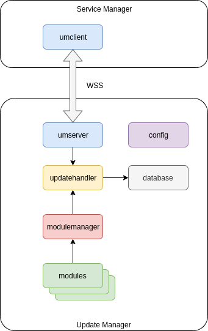

# UM Architecture

Update Manager (UM) contains following packages:
* config - provides configuration for UM itself and update modules
* database - stores current update state, files info, statuses etc.
* modulemanager - creates, stores and manages update modules
* [statecontroller](statecontroller.md) - extend and customize upgrade/revert functionality depends on system requirements
* umserver - handles commands from clients (SM)
* updatehandler - manages update modules, performs module update/revert

