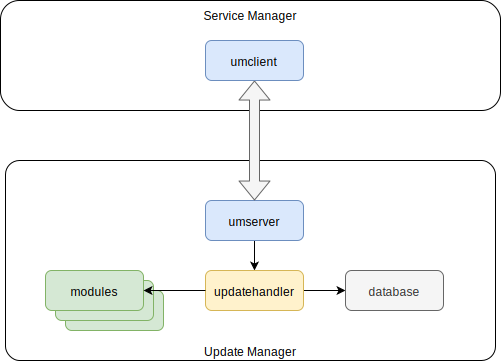
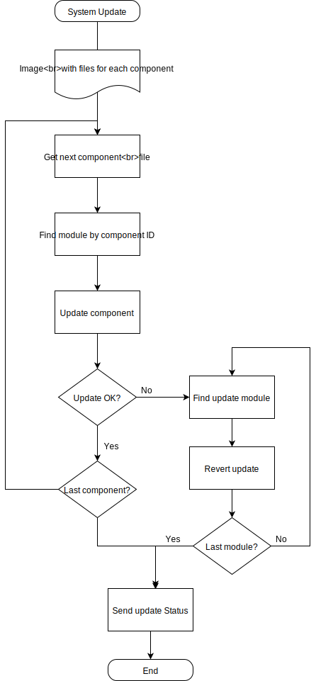

# UM Architecture

Update Manager (UM) contains following packages:
* config - provides configuration for UM itself and its modules (plugins)
* database - stores current update state, files info, statuses etc.
* umserver - handles commands from clients (SM)
* updatehandler - manages modules, performs module update/revert

Different system components are updated in different way. UM doesn't aware of how to update one or the other component. But it uses component modules which are aware of component update mechanism. When the update image is received, `updatehandler` walks through individual component files and pass the file to corresponding component module. The component module updates its component and returns update status. This status is transferred to SM through `umserver`.

