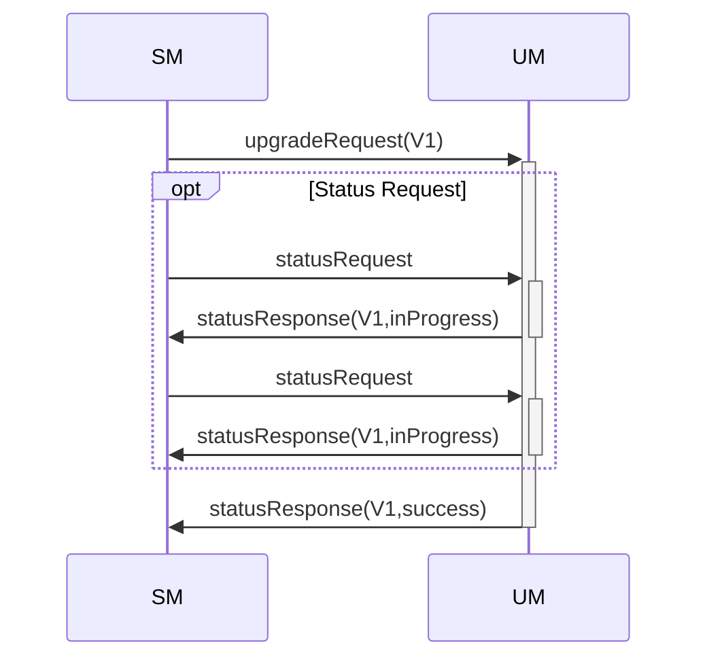
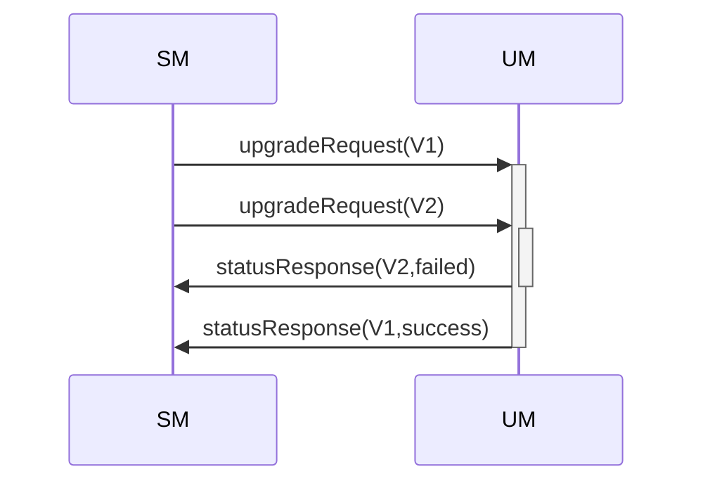

# UM Protocol

UM protocol implements following messages:

* `upgradeRequest` - sent by UM client to request system upgrade;
* `revertRequest` - sent by UM client to request system revert;
* `statusRequest` - sent by UM client to retrieve current UM status;
* `statusResponse` - sent by UM as response to any above commands.

## JSON schema

UM protocol messages JSON schema:

```json
{
    "definitions": {
        "header": {
            "description": "UM Message header",
            "type": "object",
            "required": [
                "version",
                "messageType"
            ],
            "properties": {
                "version": {
                    "description": "Protocol version",
                    "type": "integer",
                    "minimum": 1
                },
                "messageType": {
                    "description": "Message type",
                    "type": "string",
                    "enum": [
                            "upgradeRequest",
                            "revertRequest",
                            "statusRequest",
                            "statusResponse"
                    ],
                    "nullable": false
                }
            }
        },
        "imageInfo": {
            "description": "UM image info",
            "type": "object",
            "required": [
                "path",
                "sha256",
                "sha512",
                "size"
            ],
            "properties": {
                "path": {
                    "description": "Path to the image",
                    "type": "string"
                },
                "sha256": {
                    "description": "base64 encoded characters of the SHA2-256 checksum (NL/CR stripped)",
                    "type": "string"
                },
                "sha512": {
                    "description": "base64 encoded characters of the SHA2-512 checksum (NL/CR stripped)",
                    "type": "string"
                },
                "size": {
                    "description": "The size of the image file in bytes",
                    "type": "integer"
                }
            }
        },
    },
    "messages": {
        "upgradeRequest": {
            "description": "Upgrade request message",
            "type": "object",
            "required": [
                "header",
                "data"
            ],
            "properties" : {
                "header": {
                    "$ref": "#/definitions/header"
                },
                "data": {
                    "description": "Upgrade request data",
                    "type": "object",
                    "required": [
                        "imageVersion",
                        "imageInfo"
                    ],
                    "properties" : {
                        "imageVersion": {
                            "description": "Upgrade image version",
                            "type": "integer",
                            "minimum": 0
                        },
                        "imageInfo": {
                            "$ref": "#/definitions/imageInfo"
                        }
                }
            }
        },
        "revertRequest": {
            "description": "Revert request message",
            "type": "object",
            "required": [
                "header",
                "data"
            ],
            "properties" : {
                "header": {
                    "$ref": "#/definitions/header"
                },
                "data": {
                    "description": "Upgrade request data",
                    "type": "object",
                    "required": [
                        "imageVersion"
                    ],
                    "properties" : {
                        "imageVersion": {
                            "description": "Upgrade image version",
                            "type": "integer",
                            "minimum": 0
                        }
                    }
                }
            }
        },
        "statusRequest": {
            "description": "Status request message",
            "type": "object",
            "required": [
                "header"
            ],
            "properties" : {
                "header": {
                    "$ref": "#/definitions/header"
                }
            }
        },
        "statusResponse": {
            "description": "Status response message",
            "type": "object",
            "required": [
                "header",
                "data"
            ],
            "properties" : {
                "header": {
                    "$ref": "#/definitions/header"
                },
                "data": {
                    "description": "Status response data",
                    "type": "object",
                    "required": [
                        "operation",
                        "status",
                        "requestedVersion",
                        "currentVersion"
                    ],
                    "properties" : {
                        "operation": {
                            "description": "Current operation",
                            "type": "string",
                            "enum": [
                                    "upgrade",
                                    "revert"
                            ]
                        },
                        "status": {
                            "description": "Current upgrade status",
                            "type": "string",
                            "enum": [
                                    "success",
                                    "failed",
                                    "inProgress"
                            ]
                        },
                        "error": {
                            "description": "Upgrade/revert error",
                            "type": "string"
                        },
                        "requestedVersion": {
                            "description": "Requested by upgrade or revert version",
                            "type": "integer",
                            "minimum": 0
                        },
                        "currentVersion": {
                            "description": "Current system version",
                            "type": "integer",
                            "minimum": 0
                        }
                    }
                }
            }
        }
    }
}
```

## Message examples

`upgradeRequest` example:

```json
{
    "header": {
        "version": 1,
        "messageType": "upgradeRequest"
    },
    "data": {
        "imageVersion": 34,
        "imageInfo": {
            "path": "/this/is/path/to/image",
            "sha256": "wNWY3M2Y3ZWFmYmY5MTdjNThiN2JjYw==",
            "sha512": "DslY3M2Y3ZWFKADlksddjNThiN2JjYw==",
            "size": 4567
        }
    }
}
```

`revertRequest` example:

```json
{
    "header": {
        "version": 1,
        "messageType": "revertRequest"
    },
    "data": {
        "imageVersion": 33
    }
}
```

`statusRequest` example:

```json
{
    "header": {
        "version": 1,
        "messageType": "statusRequest"
    }
}
```

`statusResponse` example:

```json
{
    "header": {
        "version": 1,
        "messageType": "statusResponse"
    },
    "data": {
        "operation": "revert",
        "status": "failed",
        "error": "this is serious error",
        "requestedVersion": 13,
        "currentVersion": 14
    }
}
```

## Upgrade sequence

In order to start the upgrade, SM sends `upgradeRequest` to the UM. When the upgrade finishes, SM receives `statusResponse` with upgrade status. SM may send `statusRequest` message during or after the upgrade.



If SM sends another upgrade request when previous is not finished yet, UM sends failed status with the error field:


